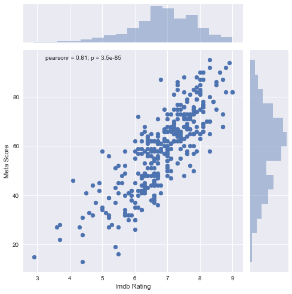
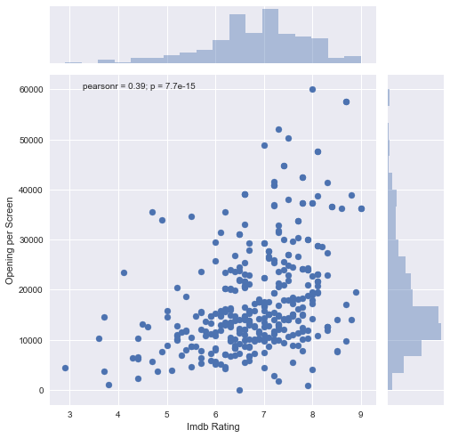
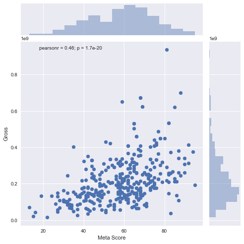
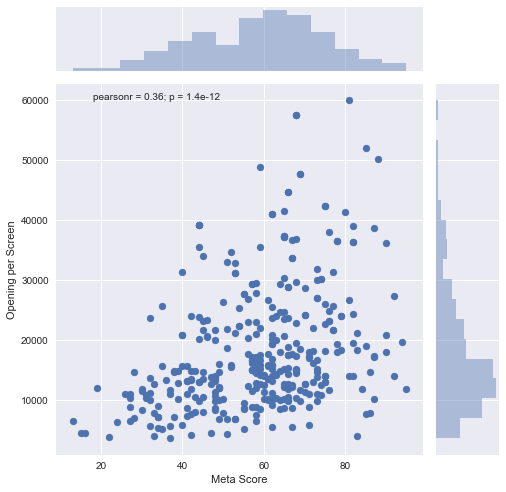
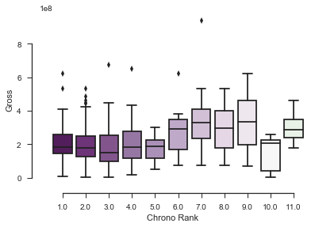

# Untitled-movie-project
## Big data exploration of movie franchises

Dependencies:
1. Beautiful soup

2. Pandas

3. Matplotlib

4. Seaborn

Images generated:
IMDb vs Metacritic Ratings

   

   

   

   

   

   

​	

